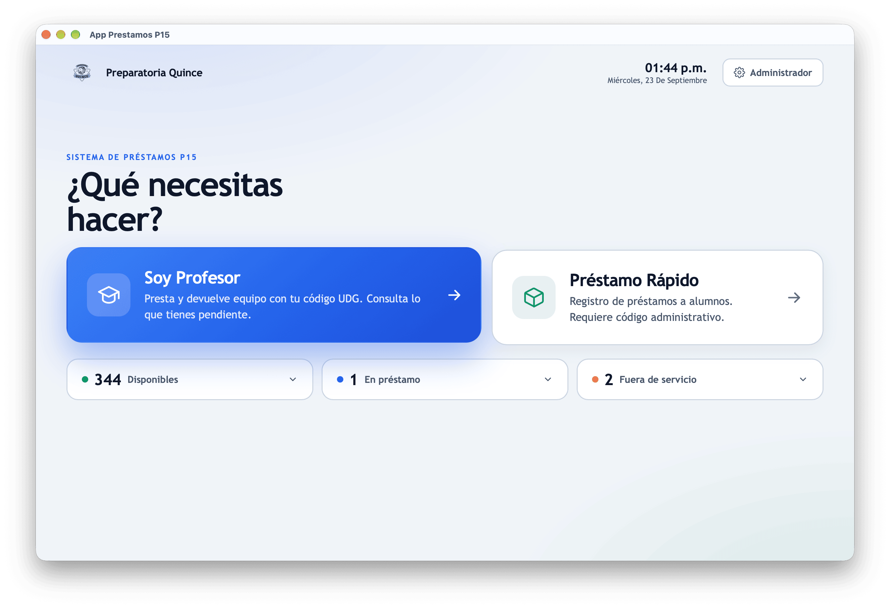
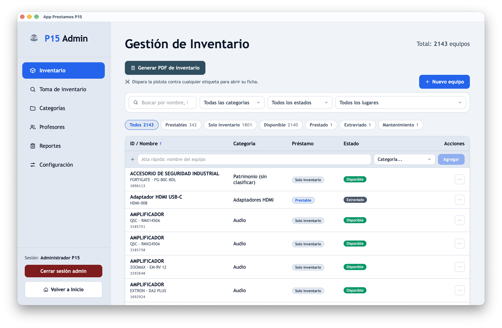
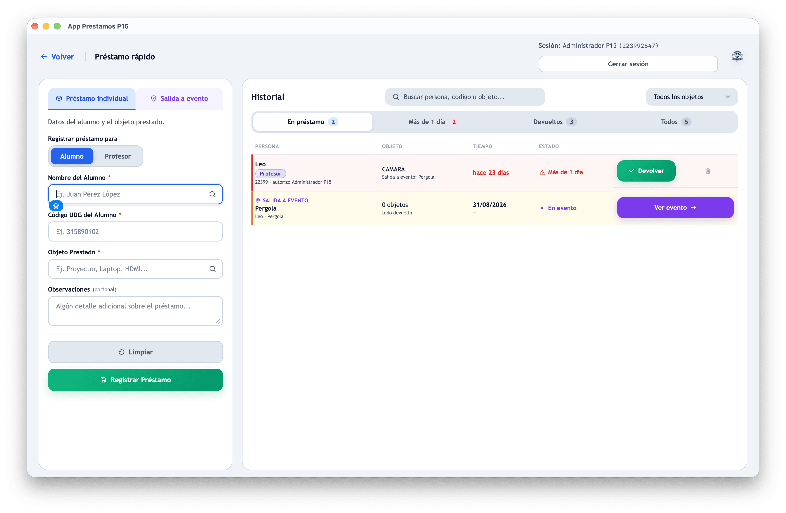

<div align="center">

# 🏫 App Prestamos P15

### Control de inventario y préstamos de equipo audiovisual para la Preparatoria 15 (UDG)

<p align="center">
  
</p>

[]()
[]()
[]()
[]()
[]()

</div>

---

> **Este README está escrito para CUALQUIER persona**: profesor, administrador, becario o alguien que nunca programó. Si eres programador, salta a la sección [Para programadores](#-para-programadores-configurar-y-compilar).

---

## 📑 Tabla de contenidos

1. [¿Qué es esta app?](#-qué-es-esta-app)
2. [¿Para quién es?](#-para-quién-es)
3. [Vista rápida](#-vista-rápida-qué-puede-hacer)
4. [Instalación para usuarios finales](#-instalación-para-usuarios-finales-no-programadores)
5. [Cómo usar la app paso a paso](#-cómo-usar-la-app-paso-a-paso)
6. [Dónde están guardadas las cosas](#-dónde-están-guardadas-las-cosas)
7. [Respaldo y recuperación](#-respaldo-y-recuperación-importante)
8. [Mantenimiento](#-mantenimiento)
9. [GitHub para principiantes](#-github-para-principiantes)
10. [Para programadores](#-para-programadores-configurar-y-compilar)
11. [Estructura del proyecto](#-estructura-del-proyecto-dónde-está-cada-cosa)
12. [Dudas frecuentes](#-dudas-frecuentes)
13. [Créditos](#-créditos)

---

## 🎯 ¿Qué es esta app?

Es un **programa de escritorio** (una aplicación que instalas en una computadora con Windows, NO en el navegador ni en el celular) que sirve para **llevar el control de los equipos audiovisuales** que la Preparatoria 15 presta a sus profesores y alumnos:

- 🖥 Laptops
- 🔌 Adaptadores HDMI
- 📽 Proyectores
- 🎤 Cualquier equipo prestable

La app responde a 3 preguntas básicas:

1. **¿Qué equipo prestamos?**
2. **¿A quién se lo prestamos?**
3. **¿Cuándo nos lo devolvieron?**

Y mantiene un historial completo: si el equipo está disponible, prestado, perdido o en reparación.

> 💡 Piensa en ella como una **libreta digital de préstamos** — pero que no se pierde, no se borra, y la pueden usar varias personas al mismo tiempo (en la misma computadora).

---

## 👥 ¿Para quién es?

| Rol | Qué hace en la app |
|---|---|
| 🎓 **Profesor** | Entra al "Kiosko", escribe su código UDG, pide un equipo y lo devuelve. **No necesita contraseña.** |
| 🛡 **Administrador** | Entra al panel Admin con código + PIN: da de alta equipos, profesores, categorías, genera reportes, hace respaldos. |
| ⚡ **Administrador de Préstamo Rápido** | Entra solo con su código (sin PIN) para registrar préstamos a **alumnos** con trazabilidad. |

> ⚠️ **Importante**: la app está pensada para **una computadora compartida** (por ejemplo, la de la oficina de audiovisuales o la coordinación). No es una app web ni un sistema en la nube: los datos viven **dentro de esa computadora**.

---

## 🖼 Vista rápida: qué puede hacer

<div align="center">

| Modo | Captura |
|---|---|
| **🏠 Inicio** — pantalla central con 3 tarjetas |  |
| **🛠 Admin** — acceso admin (código + PIN) |  |
| **⚡ Préstamo Rápido** — acceso admin (solo código) |  |
| **📱 Kiosko** — _(requiere Tauri + SQLite; ver nota)_ | _(pendiente)_ |

</div>

> 📸 **Nota sobre las capturas**: las tres primeras se tomaron con `npm run dev` (Vite solo). Mostramos la pantalla en estado **pre-login**, antes de entrar. El **Kiosko** necesita la base de datos activa desde el arranque (no tiene estado pre-login), así que su captura real requiere `npm run tauri dev` con la app de escritorio. Para actualizarlas: `npm run dev` → abrir <http://localhost:1770/> → capturar y guardar en `docs/img/`.

### Funciones principales

- ✅ Catálogo de equipos organizado por categorías
- ✅ Préstamo a profesor (kiosko) y a alumno (préstamo rápido)
- ✅ Manejo de **equipos únicos** (1 laptop = 1 registro) y **a granel** (10 adaptadores en 1 fila)
- ✅ Estados: `disponible`, `prestado`, `extraviado`, `mantenimiento`
- ✅ Reportes imprimibles en PDF (vía "imprimir" del navegador interno)
- ✅ Respaldo y restauración de la base de datos **desde dentro de la app**
- ✅ Sesión de admin con expiración de 8 horas
- ✅ Trabaja **sin internet** (todo es local)

---

## 📦 Instalación para usuarios finales (no programadores)

### Requisitos

- Una computadora con **Windows 10 o Windows 11**
- El runtime **WebView2** (viene preinstalado en Windows 11; en Windows 10 puede que lo descargues de Microsoft: <https://developer.microsoft.com/microsoft-edge/webview2/>)
- Que alguien haya generado el instalador `.exe` o `.msi` (ver [Para programadores](#-para-programadores-configurar-y-compilar))

### Pasos

1. **Consigue el instalador.** Es un archivo que termina en `.exe` o `.msi` (por ejemplo `App Prestamos P15_0.1.1_x64-setup.exe`). Hay dos formas:
   - **A) Desde GitHub (recomendado).** Entra a <https://github.com/Leoglez10/app-prestamos-p15/releases>, busca la versión más reciente, y en la sección **Assets** descarga el archivo `.exe` (_x64-setup.exe_) o `.msi`.
   - **B) Copia manual** (USB, carpeta compartida, etc.) — alguien que ya tenga el instalador te lo pasa.
2. **Cópialo a la computadora** destino si lo descargaste en otra máquina.
3. **Doble clic** sobre el instalador.
4. **Windows quizá mostrará una advertencia azul** ("Windows protegió su PC") porque no tenemos certificado de firma. No te preocupes:
   - Haz clic en **"Más información"** → **"Ejecutar de todas formas"**.
   - Esto es normal en apps de distribución interna sin certificado comercial.
5. Sigue el asistente (Siguiente → Siguiente → Instalar).
6. Al terminar, verás el ícono de la app en el escritorio o en el menú Inicio: **"App Prestamos P15"**.
7. **Ábrela**. La primera vez crea la base de datos con datos de ejemplo.

> ✅ Listo. No necesitas internet, no necesitas servidor, no necesitas configurar nada.

### Credenciales por defecto (¡CAMBIAR!)

La app viene con un administrador precargado (solo para empezar):

| Campo | Valor |
|---|---|
| Código | `223992647` |
| PIN | `#admin*p15#` |

> ⚠️ **La primera vez que entres al Admin, cambia el PIN del administrador.** No dejes el PIN de fábrica.

---

## 🚶 Cómo usar la app paso a paso

### Flujo 1: Un profesor quiere pedir prestado un equipo (Kiosko)

1. Abre la app. Verás 3 tarjetas grandes.
2. Haz clic en **"Soy Profesor"**.
3. Escribe tu **código UDG** (por ejemplo `223992647`) → Enter.
4. Verás el catálogo de equipos disponibles.
5. Elige el equipo y confirma.
6. El sistema **marca el equipo como prestado** y registra la fecha/hora.
7. Para **devolverlo**: vuelve a entrar al kiosko con tu código, ve a la sección "Préstamos activos" y marca la devolución.

### Flujo 2: Préstamo a un alumno (Préstamo Rápido)

1. En la pantalla de inicio, clic en **"Préstamo Rápido"**.
2. El admin entra con su **código** (sin PIN — esto es intencional, queda auditoría de quién autorizó).
3. Llena el formulario: nombre del alumno, código del alumno, equipo.
4. El sistema guarda automáticamente **quién autorizó** (tu nombre y código de admin).
5. Cuando el alumno regrese el equipo, márcalo como devuelto.

> 📋 Esto sirve para **incidencias rápidas** donde un alumno necesita un equipo y no pasa por el kiosko del profesor.

### Flujo 3: Administrar todo (Admin)

1. En la pantalla de inicio, clic en **"Administrador"**.
2. Escribe tu **código** y tu **PIN**.
3. Tienes pestañas:
   - **Inventario** → dar de alta, editar, marcar como perdido/mantenimiento
   - **Categorías** → crear/editar categorías (Laptops, Adaptadores, Proyectores…)
   - **Profesores** → dar de alta profesores que pueden usar el kiosko
   - **Reportes** → filtrar por fecha / estado / profesor e imprimir en PDF
   - **Configuración** → ajustes del kiosko, respaldo, restauración

### Flujo 4: Cerrar sesión

- En **Préstamo Rápido** y **Admin** hay un botón de **Cerrar sesión** arriba. Úsalo antes de irte.
- En **Préstamo Rápido** la sesión se cierra automáticamente a las **8 horas**.

---

## 📁 Dónde están guardadas las cosas

Esta app **no usa la nube**. Todo vive en la computadora donde la instalaste.

### Base de datos (¡lo más importante!)

**Ruta en Windows:**

```
C:\Users\<TUSUARIO>\AppData\Roaming\com.p15.prestamos\
├── prestamos.db          ← TU BASE DE DATOS (todos los préstamos, profesores, equipos)
├── prestamos.db-wal      ← Cache de escritura (no borrar)
├── prestamos.db-shm      ← Memoria compartida (no borrar)
└── backups\              ← Respaldos automáticos y manuales
    └── prestamos-backup-XXXXXXX.db
```

> 💡 `<TUSUARIO>` es el nombre de usuario de Windows (por ejemplo `leoel`, `administrador`, etc.).

> ⚠️ **Si borras esa carpeta, pierdes TODO el historial de préstamos.** Respáldala (ver siguiente sección).

**Cómo llegar ahí rápido** (atajo de teclado): Win + R → escribe `%AppData%\com.p15.prestamos` → Enter.

### Datos que contiene la base

| Tabla | Qué guarda |
|---|---|
| `profesores` | Lista de profesores + código UDG + si es admin + PIN si corresponde |
| `categorias` | Categorías de equipo (Laptops, Adaptadores HDMI, …) |
| `inventario` | Cada equipo: nombre, identificador, estado, si es prestable, si es granel, stock |
| `prestamos` | Historial de préstamos a profesores (fecha salida, retorno, observaciones) |
| `prestamos_rapidos_alumnos` | Préstamos a alumnos con auditoría de quién autorizó |
| `app_settings` | Configuraciones (qué se muestra en kiosko, etc.) |

> 🛠 Nota técnica: el archivo `database.sql` que verás en el repo es una **referencia histórica desactualizada**. El esquema real vive en el código, en `src/hooks/useInventory.ts`, y la app lo actualiza sola cuando se instala una nueva versión (migraciones automáticas).

---

## 💾 Respaldo y recuperación (¡IMPORTANTE!)

La app incluye **respaldo nativo** desde dentro del programa:

### Opción A: Desde la app (recomendado)

1. Entra al **Admin** → pestaña **Configuración**.
2. Botón **"Crear respaldo"**.
3. El sistema valida que el archivo sea SQL válido, lo copia a `%AppData%\com.p15.prestamos\backups\` con la fecha, y opcionalmente lo puedes mover a un USB.

### Opción B: Copiar el archivo a mano

1. Cierra la app.
2. Ve a `%AppData%\com.p15.prestamos\`.
3. Copia `prestamos.db` a un lugar seguro (USB, otra computadora, Google Drive).

### Restaurar

1. Entra al **Admin** → Configuración → **"Restaurar respaldo"**.
2. Elige el archivo `.db` que quieras restaurar.
3. El sistema valida el archivo, hace un respaldo de seguridad por si acaso, sobreescribe la base actual y limpia los archivos auxiliares WAL/SHM.
4. Reinicia la app.

> 💡 Detalle técnico bueno: el respaldo tiene validación de "magic header" (los primeros bytes dicen `SQLite format 3`), así que si eliges un archivo que no es de base de datos, se rechaza limpiamente sin romper nada.

### Respaldo automatizado con Python (opcional)

El repo trae scripts en `scripts/`:

- `backup_sqlite.py` → respaldo con checksum SHA-256 y timestamp
- `restore_sqlite.py` → restauración con copia de seguridad previa + integrity check

Más info en `docs/sqlite-backup-restore-guide.md`.

---

## 🧰 Mantenimiento

### Tareas periódicas sugeridas

| Cada… | Tarea |
|---|---|
| **Diario** | Al cerrar el día, el admin crea un respaldo (Configuración → Crear respaldo). |
| **Semanal** | Revisar préstamos activos muy antiguos (¿un equipo prestado hace 3 semanas?). |
| **Mensual** | Exportar un reporte del mes para tu archivo (Reportes → filtrar por mes → Imprimir PDF). |
| **Trimestral** | Copiar la carpeta `%AppData%\com.p15.prestamos\` a un USB y guardarlo fuera de la oficina. |
| **Anual** | Archivar el historial del año y limpiar préstamos muy antiguos. |

### Actualizar la app a una nueva versión

1. **CIERRA la app** (muy importante, no actualices con la app abierta).
2. **Crea un respaldo** por seguridad.
3. Instala el nuevo `.exe`/`.msi` (puedes instalar encima, no necesitas desinstalar).
4. Abre la app. La base de datos se conserva intacta y la app hace las migraciones necesarias sola.

> ⚠️ Si algo sale raro después de actualizar, sigue los pasos de [Respaldo y recuperación](#-respaldo-y-recuperación-importante) para volver atrás.

### Si la app no abre

| Problema | Causa probable | Solución |
|---|---|---|
| Pantalla azul "Windows SmartScreen" | Sin certificado de firma | Más información → Ejecutar de todas formas |
| La app abre en blanco | Falta WebView2 | Instalar <https://developer.microsoft.com/microsoft-edge/webview2/> |
| Se cierra sola al inicio | Falla SQLite / DB corrupta | Restaurar respaldo desde Configuración o copiar `prestamos.db` de un backup |
| Olvidé el PIN del admin | — | Hay un backdoor con código `223992647`; si pierdes acceso total, usa el respaldo más antiguo donde tenías acceso y cambia el PIN |
| Borrowé equipos y después borré la carpeta | Perdiste los datos | Si tienes respaldo en USB, recupéralo. Si no, se pierden. **Respalden siempre.** |

### Mantener el proyecto limpio

- La carpeta `dist/` y `src-tauri/target/` se **regeneran solas** al compilar. No se suben a GitHub (gracias al `.gitignore`). Si pesan mucho, puedes borrarlas.
- Los archivos que terminan en `-LeoLaptop.*` son ajustes locales de una computadora específica — **no los edites ni los subas**.

Más detalle en `docs/REPO_CLEANUP.md`.

---

## 🌐 GitHub para principiantes

GitHub es como un **Google Drive para código**: guarda versiones, lleva historial de cambios, y permite que varias personas trabajen juntas.

### Conceptos básicos

| Palabra | Qué quiere decir |
|---|---|
| **Repositorio (repo)** | La carpeta del proyecto en GitHub. |
| **Clone (clonar)** | Bajar una copia del repo a tu computadora. |
| **Commit (comprometer)** | Guardar un cambio con un mensaje explicando qué hiciste. |
| **Push (empujar)** | Subir tus commits a GitHub. |
| **Pull (jalar)** | Bajar los cambios que otros subieron. |
| **Branch (rama)** | Una versión paralela del proyecto. Para cosas grandes, trabajas en una branch y luego la unes (`main` es la principal). |
| **PR (Pull Request)** | "Pedir que revisen mis cambios antes de unirlos a main". |
| **`.gitignore`** | Archivo que lista qué carpetas no se suben (ej: `node_modules`, `target`, contraseñas). |

### 1) Clonar el proyecto (bajarlo a tu compu)

```powershell
git clone https://github.com/Leoglez10/app-prestamos-p15.git
cd app-prestamos-p15/app-prestamos-p15
```

Reemplaza `USUARIO` por el usuario/organización de GitHub. Si usas SSH:

```powershell
git clone git@github.com:Leoglez10/app-prestamos-p15.git
```

> 💡 Necesitas tener **Git** instalado. Descárgalo de <https://git-scm.com/downloads>.

### 2) Hacer un cambio y subirlo

```powershell
# 1. Ver qué cambió
git status

# 2. Subir TODO lo modificado al "área de staging"
git add .

# 3. Guardar el cambio con un mensaje claro
git commit -m "feat: agregué categoría Proyectores"

# 4. Enviarlo a GitHub
git push
```

### 3) Bajar cambios que otras personas hicieron

```powershell
git pull
```

### 4) Trabajos importantes: abrir un Pull Request

1. Crea una rama nueva:
   ```powershell
   git checkout -b feat/nueva-funcion
   ```
2. Haz tus cambios, commitea, y sube la rama:
   ```powershell
   git push -u origin feat/nueva-funcion
   ```
3. Entra a GitHub → botón verde **"Compare & pull request"** → escribe qué hiciste → **Create pull request**.
4. Alguien revisa y aprueba → se une a `main`.

### 5) Buenas prácticas para este repo

- Mensajes de commit claros en español o inglés convenido, empezando con `feat:`, `fix:`, `docs:`, `chore:`:
  - `feat: alta de proyectores`
  - `fix: problema al devolver equipos a granel`
  - `docs: actualizo README`
- **Nunca subas** archivos con contraseñas reales, ni `prestamos.db` (la base real), ni `node_modules/`, ni `target/`.
- El `.gitignore` ya los excluye, pero es bueno checarlo.
- Antes de mergear a `main`, prueba que compile: `npm run tauri build`.

### 6) CI automático

El repo tiene un workflow en `.github/workflows/build-windows.yml` que, cuando haces un push a `main` (o `master`), **compila la app en un Windows virtual de GitHub** y publica el instalador como **Release público** en la pestaña *Releases* del repo. Si la compilación falla, GitHub te avisa en rojo.

---

## 👨‍💻 Para programadores: configurar y compilar

### Stack

- **Frontend**: React 19 + TypeScript + Vite 7 + react-router-dom 7
- **Shell escritorio**: Tauri v2 (Rust, edition 2021)
- **Persistencia**: SQLite local vía `@tauri-apps/plugin-sql` 2.4.0
- **Runtime necesarios**: Node 22, Rust stable, Bun (opcional, lock presente), Windows para compilar instalador

### Requisitos previos

1. **Node.js** 22+ → <https://nodejs.org/>
2. **Rust** (rustup) → <https://rustup.rs/>
3. **Bun** (opcional, pero hay `bun.lock`) → <https://bun.sh/>
4. **Git** → <https://git-scm.com/>
5. En Windows: **Microsoft C++ Build Tools** (Visual Studio Installer → "Desktop development with C++")
6. En Windows: **WebView2 Runtime**

### Setup del repo

```powershell
git clone https://github.com/Leoglez10/app-prestamos-p15.git
cd app-prestamos-p15/app-prestamos-p15

# Instala dependencias JavaScript
npm install
# o si usas Bun:
# bun install

# Modo desarrollo (abre ventana Tauri + hot reload del frontend)
npm run tauri dev

# Solo frontend (limitado, sin base de datos — útil para maquetar)
npm run dev      # → http://localhost:1770

# Build de producción del frontend
npm run build

# Genera el instalador (.exe y .msi en Windows)
npm run tauri build
```

> ⚠️ En `npm run dev` (solo Vite) la app **funciona de forma limitada** porque no tiene Tauri y, por tanto, no puede abrir SQLite. Para desarrollo real usa siempre `npm run tauri dev`.

### Dónde sale el instalador

```
src-tauri/target/release/bundle/
├── msi/App Prestamos P15_0.1.1_x64_en-US.msi
└── nsi/App Prestamos P15_0.1.1_x64-setup.exe
```

### Scripts disponibles

| Script | Qué hace |
|---|---|
| `npm run dev` | Vite dev server (puerto 1770). Sin Tauri. |
| `npm run build` | `tsc` + `vite build` → genera `dist/` |
| `npm run preview` | Sirve `dist/` para previsualizar |
| `npm run tauri dev` | Desarrollo completo con Tauri + SQLite |
| `npm run tauri build` | Genera instalador Windows |

### Chequeo de tipos (no hay tests)

```powershell
npx tsc --noEmit
```

> ❗ El proyecto **no tiene suite de pruebas ni linter**. Cambios grandes deben validarse manualmente. Ver `docs/ENGINEERING_HANDBOOK.md`.

### Configuración de Vite

- Dev port: **1770** (estricto, falla si ocupado)
- HMR: **1771**
- Ignora watch de `src-tauri/**`
- Ver `vite.config.ts`.

### Configuración de Tauri

- Ventana 1280×840 (mín 1024×680), redimensionable
- CSP: `null`
- Identificador: `com.p15.prestamos`
- Ver `src-tauri/tauri.conf.json`

---

## 🗺 Estructura del proyecto: dónde está cada cosa

```
app-prestamos-p15/                ← Carpeta del repo
└── app-prestamos-p15/            ← Carpeta real del proyecto (necesaria así para el CI)
    │
    ├── 📄 package.json            ← Dependencias JS y scripts
    ├── 📄 vite.config.ts         ← Configuración Vite
    ├── 📄 tsconfig.json          ← Reglas TypeScript
    ├── 📄 index.html             ← Entrada HTML (carga React)
    │
    ├── 🖼 img/
    │   ├── logo-p15.png          ← Logo de la P15 (usar en reportes y README)
    │   └── logo-p15.jpg
    │
    ├── 📁 public/                ← Assets estáticos públicos (SVGs de Tauri/Vite)
    │
    ├── 📁 src/                   ← CÓDIGO FRONTEND (React + TS)
    │   ├── main.tsx              ← Punto de arranque (envuelve App con AuthProvider)
    │   ├── App.tsx               ← Router. 4 rutas: /, /admin, /kiosko, /prestamo-rapido
    │   ├── App.css               ← Estilos globales
    │   ├── auth/                 ← Lógica de autenticación
    │   │   ├── AuthContext.tsx   ← Provider de sesión (revalida contra DB)
    │   │   ├── LoginForm.tsx     ← Form code-only para Préstamo Rápido
    │   │   ├── loginStorage.ts   ← Guarda sesión en localStorage (TTL 8h)
    │   │   ├── SessionBadge.tsx  ← Badge "Sesión: nombre (código)"
    │   │   └── types.ts
    │   ├── hooks/
    │   │   └── useInventory.ts   ← ⭐ EL CORAZÓN DE LA APP (1100+ líneas)
    │   │                            Define el esquema, migraciones, reglas de negocio,
    │   │                            y todos los accesos a SQLite.
    │   ├── pages/
    │   │   ├── Home.tsx          ← Pantalla con 3 tarjetas (Profesor/Admin/Préstamo Rápido)
    │   │   ├── Kiosk.tsx         ← Flujo del profesor
    │   │   ├── Admin.tsx         ← Panel admin (inventario, categorías, profesores, reportes, config)
    │   │   ├── PrestamoRapido.tsx← Préstamo a alumnos con autenticación simple
    │   │   └── Admin-LeoLaptop.tsx ← Variante NO TOCAR (drift local)
    │   └── utils/
    │       ├── print.ts          ← Genera HTML e imprime PDF vía iframe + window.print()
    │       └── datetime.ts       ← Parseo/formateo de fechas SQLite (es-MX)
    │
    ├── 🦀 src-tauri/              ← CÓDIGO RUST (shell del escritorio)
    │   ├── Cargo.toml            ← Dependencias Rust
    │   ├── tauri.conf.json       ← Configuración de la ventana, bundle, identificador
    │   ├── src/
    │   │   └── lib.rs            ← 4 comandos nativos:
    │   │                            🔹 get_database_url    → ruta de la BD
    │   │                            🔹 create_backup        → crea backups en disco
    │   │                            🔹 list_backups         → enumera respaldos
    │   │                            🔹 restore_backup_from_bytes → restaura validando magic header
    │   ├── capabilities/
    │   │   └── default.json      ← Permisos: core, opener, sql (execute, load, select)
    │   └── icons/                ← Iconos de Windows (.ico, .icns, PNGs)
    │
    ├── 📊 database.sql           ← Paper trail histórico (NO es la fuente de verdad)
    │
    ├── 📁 docs/                   ← DOCUMENTACIÓN TÉCNICA
    │   ├── ENGINEERING_HANDBOOK.md   ← Guía maestra de ingeniería y mantenimiento
    │   ├── REPO_CLEANUP.md           ← Qué borrar/archivar
    │   ├── sqlite-backup-restore-guide.md
    │   ├── postgres-restore-guide.md ← ETL legacy Postgres→SQLite
    │   ├── legacy_profile.json       ← Perfil del schema Postgres histórico
    │   └── archive/                  ← Documentos históricos (COMPLETADO, TODO, etc.)
    │
    ├── 📁 scripts/               ← UTILITARIOS PYTHON
    │   ├── backup_sqlite.py
    │   ├── restore_sqlite.py
    │   ├── migrate_postgres_to_sqlite.py
    │   ├── migrate_legacy_p15_to_sqlite.py
    │   └── legacy_table_mapping.sample.json
    │
    ├── 📁 openspec/               ← SDD (Spec-Driven Development)
    │   ├── config.yaml            ← Reglas del proceso SDD
    │   ├── specs/                 ← Especificaciones vivas
    │   └── changes/archive/       ← Cambios ya cerrados (admin-auth, login-solo-codigo)
    │
    ├── 📁 .github/workflows/
    │   └── tauri-build.yml        ← CI: compila en Windows virtual cada push a main
    │
    ├── 📁 .agents/skills/         ← Skills personales de AI (no se suben al hacer cambios)
    └── 📄 README.md               ← ESTE ARCHIVO
```

> 💡 Regla de oro para principiantes:
> - **Pantallas y botones** → están en `src/pages/`
> - **Lógica de datos y reglas** → está en `src/hooks/useInventory.ts`
> - **Cómo se abre el programa en el escritorio** → está en `src-tauri/`
> - **Documentación para desarrolladores** → está en `docs/`

---

## ❓ Dudas frecuentes

**¿Necesito internet para usarla?**
No. Todo es local: la base de datos está dentro de la computadora.

**¿Puedo usarla en Mac o Linux?**
El instalador actual solo se genera para Windows. En Mac/Linux puedes compilar el código fuente si eres programador, pero no hay build oficial.

**¿Dónde veo el historial de préstamos?**
En el panel del Admin → pestaña Reportes. Filtras por fecha o profesor y das "Imprimir" para tener un PDF.

**¿Cómo doy de alta un profesor nuevo?**
Admin → Profesores → "Nuevo" → nombre y código UDG. Si también será admin, marca el checkbox y define un PIN.

**¿Cómo marco un equipo como perdido?**
Admin → Inventario → editar el equipo → estado "extraviado". A partir de ahí no aparecerá para préstamo.

**¿Mi base de datos se borró, qué hago?**
Si tienes respaldo (en `backups/` o en un USB), lo restauras desde Configuración. Si no, **se perdió**. Por eso **RESPALDA SIEMPRE**.

**¿Puedo tener varias computadoras con la app?**
Sí, pero **cada una tiene su base de datos independiente**. No se sincronizan entre sí. Si necesitas mover datos de una a otra, usa "Crear respaldo" y "Restaurar respaldo".

**¿La app manda datos a algún servidor externo?**
No. No hay telemetría, no hay envío a la nube, no hay cuenta de correo, no hay nada de internet.

**¿Es seguro el PIN por defecto?**
No, es un valor que viene para que puedas entrar la primera vez. **Cámbialo en cuanto entres.**

---

## 🤝 Cómo contribuir

1. Clona el repo.
2. Crea una branch: `git checkout -b feat/mi-cambio`.
3. Haz commits claros: `feat: agregué exportación a Excel`.
4. Verifica que compile: `npm run tauri build` (o al menos `npx tsc --noEmit`).
5. Abre un Pull Request explicando qué hiciste y por qué.
6. Espera revisión. Si hay comentarios, ajusta y vuelve a push.

> 📚 Antes de tocar cosas grandes, lee `docs/ENGINEERING_HANDBOOK.md`. Hay deudas técnicas documentadas (archivos `-LeoLaptop.*`, monolito en `Admin.tsx`, mezcla en `useInventory.ts`).

---

## 🏷 Versionado

Usamos versionado simple `MAYOR.MENOR.PARCHE` en `package.json` y `tauri.conf.json`. Ej: `0.1.1`.

- **PARCHE** (0.1.**1** → 0.1.2): bugfixes, sin cambios de comportamiento.
- **MENOR** (0.**1**.1 → 0.2.0): nuevas funciones, sin romper lo viejo.
- **MAYOR** (**0**.1.1 → 1.0.0): cambios que pueden romper compatibilidad (requieren migración).

> ⚠️ `Cargo.toml` (Rust) puede estar ligeramente desincronizado con `package.json`. Cuando cambies versión, actualízalo también en `Cargo.toml`.

---

## 📚 Documentación relacionada

| Doc | Para qué sirve |
|---|---|
| [docs/ENGINEERING_HANDBOOK.md](app-prestamos-p15/docs/ENGINEERING_HANDBOOK.md) | **Guía maestra** para mantener el código |
| [docs/REPO_CLEANUP.md](app-prestamos-p15/docs/REPO_CLEANUP.md) | Qué carpetas borrar/archivar |
| [docs/sqlite-backup-restore-guide.md](app-prestamos-p15/docs/sqlite-backup-restore-guide.md) | Backup/restore con scripts Python |
| [docs/postgres-restore-guide.md](app-prestamos-p15/docs/postgres-restore-guide.md) | Migrar desde un Postgres legacy |
| [README_INSTALACION.md](README_INSTALACION.md) | Instalación y actualización manual |

---

## ⚖️ Licencia y uso

Proyecto de **uso interno educativo** para la Preparatoria 15 (UDG). No está pensado para distribución comercial.

---

## 🙌 Créditos

<div align="center">

### Desarrollado por **Leonardo González** 👨‍💻

[]()

</div>

- 🏫 **Institución**: Preparatoria 15 — Universidad de Guadalajara (UDG)
- 🎯 **Propósito**: Control y trazabilidad de préstamos de equipo audiovisual
- 🛠 **Stack**: Tauri v2 · React 19 · TypeScript · Vite 7 · Rust · SQLite

> 📬 Si encuentras un bug o tienes una mejora, abre un [Issue](https://github.com/Leoglez10/app-prestamos-p15/issues) o un Pull Request.

---

<div align="center">

**¿Dudas?** Revisa la sección [Dudas frecuentes](#-dudas-frecuentes) o el [Handbook de ingeniería](app-prestamos-p15/docs/ENGINEERING_HANDBOOK.md) antes de preguntar. Salves un bolígrafo, salven un dato 💾

</div>